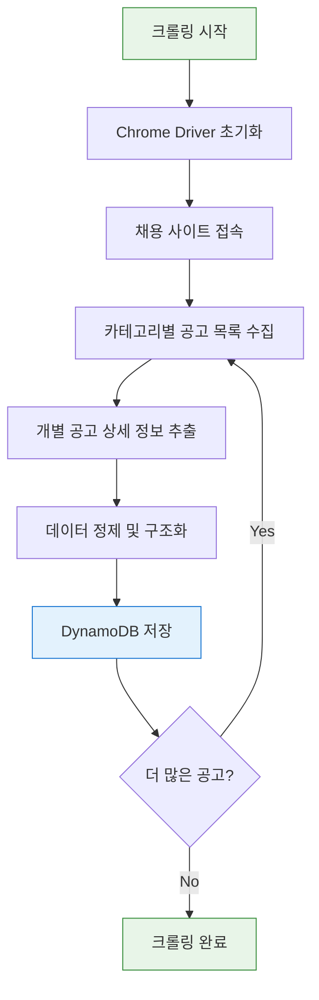

# 📊 채용 공고 크롤링 시스템

채용 플랫폼에서 공고 데이터를 자동으로 수집하고 정제하여 데이터베이스에 저장하는 시스템입니다.

## 📋 목차

- [시스템 개요](#시스템-개요)
- [크롤링 프로세스](#크롤링-프로세스)
- [파일 구조](#파일-구조)
- [주요 기능](#주요-기능)
- [데이터 구조](#데이터-구조)
- [실행 방법](#실행-방법)
- [설정 및 환경변수](#설정-및-환경변수)

## 🎯 시스템 개요

이 크롤링 시스템은 다양한 채용 사이트에서 채용 공고 정보를 자동으로 수집하여 구조화된 데이터로 변환합니다. Selenium과 BeautifulSoup을 활용한 하이브리드 크롤링 방식을 채택하여 동적 콘텐츠까지 안정적으로 수집할 수 있습니다.

### 🔧 기술 스택
- **Selenium WebDriver**: 동적 웹페이지 제어
- **BeautifulSoup**: HTML 파싱 및 데이터 추출
- **Chrome Driver**: 브라우저 자동화
- **AWS DynamoDB**: 수집된 데이터 저장
- **Python Logging**: 크롤링 과정 모니터링

## 🔄 크롤링 프로세스



### 📝 상세 단계

1. **환경 초기화**
   - Chrome WebDriver 설정 및 실행
   - 직업 카테고리 매핑 테이블 로드
   - 로깅 시스템 초기화

2. **데이터 수집**
   - 채용 사이트의 카테고리별 페이지 순회
   - 공고 목록에서 개별 URL 추출
   - 각 공고의 상세 페이지 방문

3. **정보 추출**
   - 공고 제목, 회사명, 마감일
   - 근무 위치, 경력 요구사항
   - 직무 상세 내용 및 요구 기술
   - 회사 정보 및 복리후생

4. **데이터 처리**
   - 추출된 정보 정제 및 검증
   - 표준화된 데이터 구조로 변환
   - 중복 데이터 필터링

5. **저장 및 완료**
   - AWS DynamoDB에 구조화된 데이터 저장
   - 크롤링 통계 및 결과 로깅

## 📁 파일 구조

```
DataCollection/Crawler/
├── README.md                 # 프로젝트 문서
├── main.py                   # 크롤링 실행 진입점
├── JobCrawer.py             # 핵심 크롤링 로직
├── driver.py                # Chrome WebDriver 설정
├── dynamodb.py              # DynamoDB 연결 및 저장
├── logger.py                # 로깅 설정
├── mapping_table.json       # 직업 카테고리 매핑
└── test_html_tag.py         # HTML 태그 테스트
```

## ⚙️ 주요 기능

### 🎯 **다중 카테고리 지원**
- IT/개발, 마케팅, 디자인, 영업 등 다양한 직군 지원
- 카테고리별 맞춤형 크롤링 로직
- 실시간 카테고리 매핑 업데이트

### 🔄 **안정적인 크롤링**
- 동적 콘텐츠 로딩 대기
- 네트워크 오류 재시도 메커니즘
- 사이트 변경 감지 및 적응

### 📊 **데이터 품질 관리**
- 필수 필드 검증
- 데이터 타입 변환 및 정규화
- 중복 제거 및 무결성 검사

### 🔍 **모니터링 & 로깅**
- 실시간 크롤링 진행 상황 추적
- 에러 발생 시 상세 로그 기록
- 성능 메트릭 수집

## 📋 데이터 구조

수집되는 채용 공고 데이터의 구조:

```json
{
  "url": "채용공고 URL",
  "crawled_at": "2024-01-01T00:00:00Z",
  "job_category": "직무 카테고리 ID",
  "job_name": "직무명",
  "title": "채용공고 제목",
  "company_name": "회사명",
  "company_id": "회사 ID",
  "dead_line": "마감일",
  "location": "근무지역",
  "career": "경력 요구사항",
  "position_detail": "직무 상세 내용",
  "main_tasks": "주요업무",
  "qualifications": "자격 요건",
  "preferred_qualifications": "우대 사항",
  "benefits": "복리후생",
  "hiring_process": "채용 전형"
}
```

## 🚀 실행 방법

### 1. 환경 설정
```bash
# Python 환경 활성화
conda activate mmd

# 필요한 패키지 설치
pip install selenium beautifulsoup4 boto3 webdriver-manager
```

### 2. 환경 변수 설정
```bash
# .env 파일에 AWS 자격증명 추가
AWS_ACCESS_KEY_ID=your_access_key
AWS_SECRET_ACCESS_KEY=your_secret_key
AWS_REGION=ap-northeast-2
```

### 3. 크롤링 실행
```bash
# 크롤링 디렉토리로 이동
cd DataCollection/Crawler

# 크롤링 시작
python main.py
```

### 4. 실행 결과 확인
```bash
# 로그를 통한 진행 상황 모니터링
# DynamoDB에서 수집된 데이터 확인
```

## ⚙️ 설정 및 환경변수

### Chrome Driver 설정
- **자동 버전 관리**: webdriver-manager를 통한 자동 업데이트
- **헤드리스 모드**: 서버 환경에서 백그라운드 실행 지원
- **성능 최적화**: GPU 비활성화, 메모리 사용량 최적화

### 크롤링 파라미터
- **지연 시간**: 사이트 부하 방지를 위한 요청 간격 조절
- **재시도 횟수**: 네트워크 오류 시 재시도 설정
- **타임아웃**: 페이지 로딩 대기 시간 설정

### 데이터베이스 설정
- **배치 저장**: 여러 레코드를 묶어서 효율적 저장
- **오류 처리**: 저장 실패 시 재시도 및 로깅
- **인덱싱**: 검색 성능을 위한 적절한 인덱스 설정

## 🔧 주의사항

1. **사이트 정책 준수**: robots.txt 및 이용약관 확인
2. **적절한 크롤링 간격**: 서버 부하 방지를 위한 지연 시간 설정
3. **데이터 보안**: 민감한 정보 처리 시 개인정보보호법 준수
4. **모니터링**: 장시간 실행 시 리소스 사용량 모니터링 필요

## 📞 문제 해결

### 자주 발생하는 문제들

- **Chrome Driver 오류**: `webdriver-manager`로 자동 해결
- **메모리 부족**: 배치 크기 조절 및 가비지 컬렉션
- **네트워크 타임아웃**: 재시도 로직 및 대기 시간 증가
- **사이트 구조 변경**: 셀렉터 업데이트 및 테스트 코드 활용
