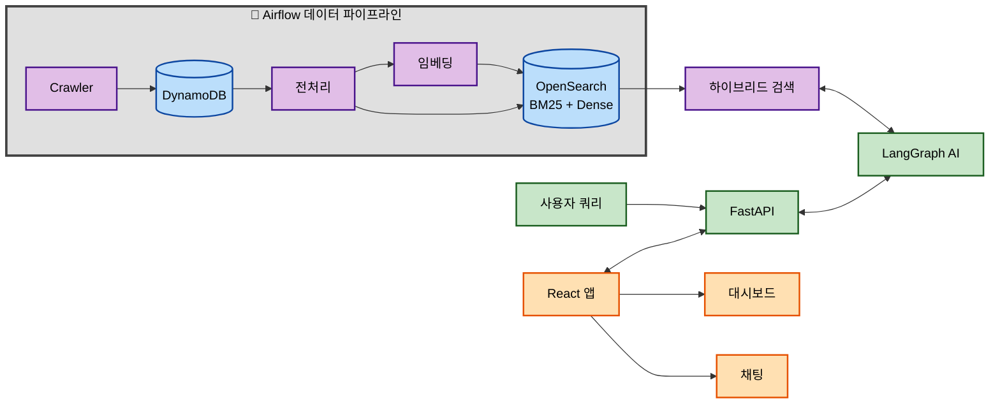

<div align="center">

# MangMangDae-AI

채용 플랫폼의 공고를 수집하여, AI 기반의 하이브리드 검색 및 추천 서비스를 제공하는 시스템입니다.

---

### Team Members

| Name | GitHub |
| :--: | :--: |
| 박종언 | [@statpje](https://github.com/statpje) |
| 오영민 | [@oymin2001](https://github.com/oymin2001) |
| 장찬우 | [@grrlkk](https://github.com/grrlkk) |
| 정현우 | [@statjhw](https://github.com/statjhw) |

</div>

### Tech Stack

[](https://python.org)
[](https://developer.mozilla.org/en-US/docs/Web/JavaScript)
[](https://fastapi.tiangolo.com/)
[](https://reactjs.org/)
[](https://aws.amazon.com/dynamodb/)
[](https://opensearch.org/)
[](https://redis.io/)
[](https://langchain.com/)
[](https://www.sbert.net/)
[](https://airflow.apache.org/)
[](https://git-scm.com/)
[](https://docker.com/)

## 📋 목차 (Table of Contents)

- [1. 프로젝트 개요 (Introduction)](#1-프로젝트-개요-introduction)
- [2. 주요 기능 (Key Features)](#2-주요-기능-key-features)
- [3. 시스템 아키텍처 (System Architecture)](#3-시스템-아키텍처-system-architecture)
- [4. 시작하기 (Getting Started)](#4-시작하기-getting-started)
  - [4.1 환경 설정](#41-환경-설정)
  - [4.2 환경 변수 설정](#42-환경-변수-설정)
  - [4.3 실행 방법](#43-실행-방법)
  - [4.4 접속 정보](#44-접속-정보)
  - [4.5 개발 팁](#45-개발-팁)
- [5. 라이선스 (License)](#5-라이선스-license)
- [6. 향후 개발 계획 (Future Development)](#6-향후-개발-계획-future-development)

<br>

## 1. 프로젝트 개요 (Introduction)

MangMangDae-AI는 채용 정보를 이용해  사용자에게 최적의 정보를 제공하는 것을 목표로 합니다. 최신 채용 공고를 자동으로 수집하고, AI 기술을 활용한 하이브리드 검색을 통해 사용자가 원하는 정보를 정확하고 빠르게 찾을 수 있도록 돕습니다.

<br>

##  2. 주요 기능 (Key Features)

*   **데이터 수집 자동화**: 여러 채용 사이트의 공고를 주기적으로 크롤링하여 원본 데이터를 **AWS DynamoDB**에 수집하고, 이를 가공하여 **OpenSearch**에 키워드 및 벡터 인덱스를 구축합니다.
*   **하이브리드 검색**: **OpenSearch** 내에서 키워드 기반의 검색(BM25)과 의미 기반의 벡터 검색(Dense)을 결합한 하이브리드 리트리버를 구현하여 검색 정확도를 극대화합니다.
*   **AI 에이전트 워크플로우**: **LangGraph** 기반의 자율 에이전트가 검색된 정보를 바탕으로 특정 과업을 수행하고, 사용자 질의에 대한 심층적인 답변을 생성합니다.
*   **RESTful API**: **FastAPI**를 사용하여 프로젝트의 모든 기능을 외부에서 활용할 수 있도록 안정적인 API를 제공합니다.

<br>

##  3. 시스템 아키텍처 (System Architecture)

본 프로젝트는 마이크로서비스 아키텍처를 기반으로 각 기능이 독립적으로 구성되어 있으며, 아래와 같은 데이터 흐름을 따릅니다. 각 컴포넌트에 대한 자세한 내용은 해당 디렉토리의 `README.md` 파일을 참고하십시오.



*   **[데이터 수집](./DataCollection/README.md)**: `Airflow`가 `Crawler`를 주기적으로 실행하여 채용 정보를 수집하고 `AWS DynamoDB`에 저장합니다.
*   **[데이터 처리 및 인덱싱](./DataCollection/Dynamo_to_Opensearch/README.md)**: `DynamoDB`의 데이터를 전처리하고 벡터 임베딩을 생성하여 `OpenSearch`에 키워드 및 벡터 인덱스를 구축합니다.
*   **[하이브리드 검색](./Retrieval/README.md)**: `OpenSearch`에서 BM25 키워드 검색과 Dense 벡터 검색을 동시에 수행하고, 점수 정규화 및 재정렬을 통해 검색 정확도를 극대화합니다.
*   **[AI 워크플로우](./WorkFlow/README.md)**: 검색 결과를 바탕으로 AI 에이전트가 작업을 수행하여 최종 응답을 생성합니다.
*   **[백엔드 API](./Backend/README.md)**: `FastAPI`를 통해 전체 워크플로우를 API로 노출합니다.
*   **[프론트엔드](./Frontend/README.md)**: 백엔드 API와 통신하여 사용자에게 서비스를 제공합니다.

<br>

## 4. 시작하기 (Getting Started)

### 4.1 환경 설정

#### 사전 요구사항
- Python 3.9+
- Node.js 18+
- Git
- Docker (선택사항)

#### 1. 저장소 클론
```bash
git clone https://github.com/your-username/MangMangDae-AI.git
cd MangMangDae-AI
```

#### 2. Python 환경 설정
```bash
# Conda 환경 생성 (권장)
conda create -n mmd python=3.9
conda activate mmd

# 또는 venv 사용
python -m venv venv
source venv/bin/activate  # Windows: venv\Scripts\activate
```

#### 3. 의존성 설치
```bash
# Python 패키지 설치
pip install -r requirements.txt

# 프론트엔드 의존성 설치
cd Frontend
npm install
cd ..
```

### 4.2 환경 변수 설정

`.env` 파일을 프로젝트 루트에 생성하고 다음 변수들을 설정하세요:

```bash
# OpenAI API
OPENAI_API_KEY=your_openai_api_key

# AWS 설정
AWS_ACCESS_KEY_ID=your_aws_access_key
AWS_SECRET_ACCESS_KEY=your_aws_secret_key
AWS_REGION=ap-northeast-2

# OpenSearch 설정
OPENSEARCH_HOST=your_opensearch_host
OPENSEARCH_PORT=443
OPENSEARCH_USE_SSL=true
OPENSEARCH_VERIFY_CERTS=true

# Tavily API (웹 검색)
TAVILY_API_KEY=your_tavily_api_key

# Redis 설정 (선택사항)
REDIS_HOST=localhost
REDIS_PORT=6379
```

### 4.3 실행 방법

#### 백엔드 서버 실행
```bash
# 백엔드 디렉토리로 이동
cd Backend

# FastAPI 서버 실행
uvicorn app.main:app --host 0.0.0.0 --port 8000 --reload
```

#### 프론트엔드 실행
```bash
# 새 터미널에서 프론트엔드 디렉토리로 이동
cd Frontend

# React 개발 서버 실행
npm start
```

#### 데이터 수집 실행 (선택사항)
```bash
# 데이터 수집 디렉토리로 이동
cd DataCollection/Crawler

# 크롤러 실행
python main.py
```

### 4.4 접속 정보
- **프론트엔드**: http://localhost:3000
- **백엔드 API**: http://localhost:8000
- **API 문서**: http://localhost:8000/docs

### 4.5 개발 팁
- 백엔드는 `--reload` 옵션으로 실행하여 코드 변경 시 자동 재시작
- 프론트엔드는 Hot Module Replacement로 실시간 업데이트
- API 테스트는 FastAPI의 Swagger UI(`/docs`) 또는 Postman 활용
- 로그는 각 모듈의 `logger.py`를 통해 확인 가능

<br>

## 5. 라이선스 (License)

이 프로젝트는 [MIT License](./LICENSE)를 따릅니다.


## 6. 향후 개발 계획 (Future Development)

### 6.1 현재 상태
- ✅ 1차 스프린트 개발 완료
- ✅ 시스템 아키텍처 구축
- ✅ 기본 기능 구현

### 6.2 추후 추가 예정
- [ ] 웹사이트 스크린샷 및 사용 가이드 추가
- [ ] 프로덕션 배포 아키텍처 문서화
- [ ] 고급 AI 분석 기능 확장
