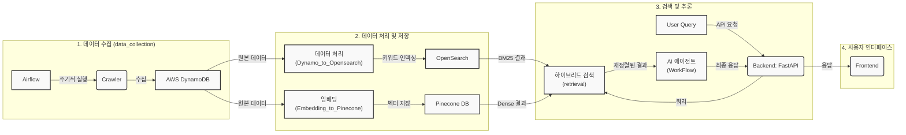

# MangMangDae-AI

채용 플랫폼의 공고를 수집하여, AI 기반의 하이브리드 검색 및 추천 서비스를 제공하는 시스템입니다.

---

### Team Members

| Name | GitHub |
| :--: | :--: |
| 박종언 | [@statpje](https://github.com/statpje) |
| 오영민 | [@oymin2001](https://github.com/oymin2001) |
| 장찬우 | [@grrlkk](https://github.com/grrlkk) |
| 정현우 | [@statjhw](https://github.com/statjhw) |

### Tech Stack

## 1. 프로젝트 개요 (Introduction)

MangMangDae-AI는 채용 정보를 이용해  사용자에게 최적의 정보를 제공하는 것을 목표로 합니다. 최신 채용 공고를 자동으로 수집하고, AI 기술을 활용한 하이브리드 검색을 통해 사용자가 원하는 정보를 정확하고 빠르게 찾을 수 있도록 돕습니다.

##  2. 주요 기능 (Key Features)

*   **데이터 수집 자동화**: 여러 채용 사이트의 공고를 주기적으로 크롤링하여 원본 데이터를 **AWS DynamoDB**에 수집하고, 이를 가공하여 검색 및 분석에 용이한 데이터 마트(**OpenSearch**)를 구축합니다.
*   **하이브리드 검색**: 키워드 기반의 검색(BM25)과 의미 기반의 벡터 검색(Dense)을 결합한 하이브리드 리트리버를 구현하여 검색 정확도를 극대화합니다.
*   **AI 에이전트 워크플로우**: **LangGraph** 기반의 자율 에이전트가 검색된 정보를 바탕으로 특정 과업을 수행하고, 사용자 질의에 대한 심층적인 답변을 생성합니다.
*   **RESTful API**: **FastAPI**를 사용하여 프로젝트의 모든 기능을 외부에서 활용할 수 있도록 안정적인 API를 제공합니다.

##  3. 시스템 아키텍처 (System Architecture)

본 프로젝트는 마이크로서비스 아키텍처를 기반으로 각 기능이 독립적으로 구성되어 있으며, 아래와 같은 데이터 흐름을 따릅니다. 각 컴포넌트에 대한 자세한 내용은 해당 디렉토리의 `README.md` 파일을 참고하십시오.

*   **[데이터 수집](./data_collection/README.md)**: `Airflow`가 `Crawler`를 주기적으로 실행하여 채용 정보를 수집하고 `AWS DynamoDB`에 저장합니다.
*   **[데이터 처리](./data_collection/Dynamo_to_Opensearch/README.md)**: `DynamoDB`의 데이터를 `OpenSearch`에 인덱싱하여 키워드 검색을 준비합니다.
*   **[임베딩 및 벡터 저장](./data_collection/Dynamo_to_Opensearch/README.md)**: `DynamoDB`의 데이터를 하이브리드 검색을 위해 데이터 변환하여 aws의 `OpenSearch` DB에 저장합니다.
*   **[하이브리드 검색](./retrieval/README.md)**: 사용자 쿼리에 대해 `OpenSearch`(BM25)와 `Pinecone`(Dense) 검색을 동시에 수행하고, 결과를 재정렬하여 정확도를 높입니다.
*   **[AI 워크플로우](./WorkFlow/README.md)**: 검색 결과를 바탕으로 AI 에이전트가 작업을 수행하여 최종 응답을 생성합니다.
*   **[백엔드 API](./backend/README.md)**: `FastAPI`를 통해 전체 워크플로우를 API로 노출합니다.
*   **[프론트엔드](./frontend/README.md)**: 백엔드 API와 통신하여 사용자에게 서비스를 제공합니다.

## 4. 라이선스 (License)

이 프로젝트는 [MIT License](./LICENSE)를 따릅니다.

추후 추가 내용
1. 웹 사이트 사진 + 사용 방법 설명
2. 배포 아키텍처 설명
3. 아키텍처 사진 수정
